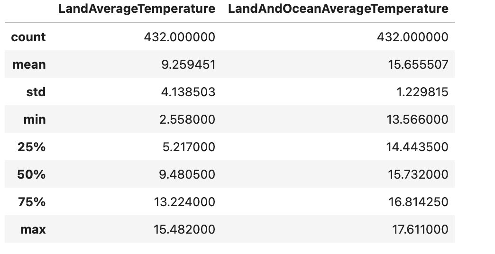

### 2 Data Cleaning

Tijdens het voorbereiden van de dataset voor de analyse, stuitte ik op een aantal ontbrekende waarden. Om deze dataset bruikbaar te maken, heb ik de volgende stappen ondernomen.

1. Interpolatie
Ik heb ervoor gekozen om de gaten in de temperatuurdata te vullen met lineaire interpolatie. Het klimaat verandert geleidelijk. Als ik de temperatuur van 1850 en 1852 weet, is een schatting voor 1851 op basis van die twee jaren veel logischer dan een gemiddelde van de hele eeuw te nemen. Door te interpoleren, blijven de natuurlijke schommelingen en trends in data beter zichtbaar.

2. Opschonen per land (`groupby`)
In de code heb ik de data gegroepeerd per land zodat ik de lege cellen kon invullen. Je kunt de ontbrekende temperatuur in Canada niet invullen met gegevens uit Curacao. Door de functie `groupby('country')`te gebruiken, zorg ik ervoor dat gaten in de data van een specifiek land alleen wordt opgevuld met waarden uit hetzelfde land. Dit voorkomt dat de data onbetrouwbaar is. 

3. Verwijderen van "ruis"
Sommige rijen hadden geen landnaam, of een ongeldige datum (zoals `0000-00-00`). Deze rijen heb ik verwijderd, zonder te weten over welk land het gaat of uit welk jaar de meting komt, voegt de data niets toe aan het onderzoek en vervuilt het de uiteindelijke grafieken.

4. Bronbestanden behouden
De opgeschoonde data heb ik opgeslagen in nieuwe tabellen in SQL (met de naam `cleaned_`)

Import & Database verbinding
```python

import pandas as pd
import sqlalchemy as sa
import numpy as np

# Verbinding maken met de lokale XAMPP MariaDB database
engine = sa.create_engine("mysql+pymysql://root:@localhost/climate_watch")
print("Verbinding met database geslaagd.")
```

Cleaning
- Ik heb vijf verschillende tabellen met elk een andere structuur. In plaats van vijf keer dezelfde code te schrijven heb ik een dictionary gemaakt. Hierin vertel ik Python: als je de stad-tabel pakt, moet je rekening houden met de kolommen `country` en `city` om de juiste locatie te bepalen.
- In de eerste regel van de `for`-loop haal ik de data op uit SQL en pas ik direct de eisen van de opdracht toe. Ik gebruik `pd.to_datetime` met `errors='coerce'` om van de datum-tekst een echt tijdsobject te maken. De 'ruis' verander ik hiermee in een leeg veld, zodat ik die rijen daarna met `dropna()` makkelijk kan verwijderen
- (`sort values`) Dit is belangrijk voor de interpolatie. Je kunt alleen een lijn trekken tussen twee punten als ze op de juiste volgorde staan. Ik sorteer de data eerst op locatie en daarna chronologisch op datum.
- `groupby`+`transform`. Ik gebruik `groupby` om de dataset op te splitsen in kleine groepjes. Binnen dat groepje pas ik `interpolate` toe. Mocht er dan aan het begin of eind van de reeks nog iets missen, gebruik ik de fallback `fillna(x.mean())` Dit vult de laatse gaten met het gemiddelde van dat specifieke land.

```python
# Configuratie per tabel: welke kolommen bepalen de unieke locatie?
tables_config = {
    'global_temperatures': [],  
    'global_temp_country': ['country'],
    'global_temp_state': ['country', 'state'], 
    'global_temp_major_city': ['country', 'city'],
    'global_temp_city': ['country', 'city'] 
}

for tabel, groepering in tables_config.items():
    # Inladen en datum filteren
    df = pd.read_sql(f"SELECT * FROM {tabel}", engine)
    df['dt'] = pd.to_datetime(df['dt'], errors='coerce')
    df_subset = df[df['dt'].dt.year >= 1980].dropna(subset=['dt']).copy()
    
    # Sorteren voor tijdreeks-analyse
    sort_cols = groepering + ['dt'] if groepering else ['dt']
    df_subset = df_subset.sort_values(by=sort_cols)

    # Numerieke kolommen identificeren
    target_cols = [c for c in df_subset.select_dtypes(include=['number']).columns if c not in ['id', 'latitude', 'longitude']]
    
    # Interpolatie toepassen (per groep indien van toepassing)
    if groepering:
        for col in target_cols:
            df_subset[col] = df_subset.groupby(groepering)[col].transform(
                lambda x: x.interpolate(method='linear', limit_direction='both')
            )
            # Fallback: vul overgebleven gaten met het groepsgemiddelde
            df_subset[col] = df_subset.groupby(groepering)[col].transform(lambda x: x.fillna(x.mean()))
    else:
        df_subset[target_cols] = df_subset[target_cols].interpolate(method='linear', limit_direction='both')

    # Opslaan naar SQL
    df_subset.to_sql(f"cleaned_{tabel}", engine, if_exists='replace', index=False)
    print(f"Tabel {tabel} succesvol verwerkt en opgeslagen.")
```

## 4 Opdrachten
##### 1 Exploration
```python
# Inladen van de opgeschoonde wereldwijde data
df_global_clean = pd.read_sql("SELECT * FROM cleaned_global_temperatures", engine)

# Gebruik van describe() voor de algemene statistieken (Opdracht 4.1)
# Focus op de belangrijkste temperatuur-kolommen
stats = df_global_clean[['LandAverageTemperature', 'LandMaxTemperature', 'LandMinTemperature', 'LandAndOceanAverageTemperature']].describe()

# Toevoegen van de Mediaan (median) omdat describe() deze niet standaard toont (behalve als 50%)
median = df_global_clean[['LandAverageTemperature', 'LandMaxTemperature', 'LandMinTemperature', 'LandAndOceanAverageTemperature']].median()
stats.loc['median'] = median

display(stats)
```

[Distributie van temperatuurwaarden over de jaren & trend in global average land temperatures over de tijd.]

```python
import matplotlib.pyplot as plt
import seaborn as sns

# Zorg dat 'dt' een datetime object is
df_global_clean['dt'] = pd.to_datetime(df_global_clean['dt'])

# 1. Distributie van de temperatuur (Histogram)
plt.figure(figsize=(10, 5))
sns.histplot(df_global_clean['LandAverageTemperature'], bins=30, kde=True, color='skyblue')
plt.title('Distributie van de Globale Landtemperatuur (1980+)')
plt.xlabel('Temperatuur (°C)')
plt.ylabel('Frequentie')
plt.show()

# 2. Jaarlijkse groepering (Opdracht 4.2)
# Groepering per jaar om de seizoensinvloeden te middelen
df_yearly = df_global_clean.groupby(df_global_clean['dt'].dt.year)['LandAverageTemperature'].mean().reset_index()

# 3. Visualisatie van de trend (Opdracht 4.3)
plt.figure(figsize=(12, 6))
sns.regplot(data=df_yearly, x='dt', y='LandAverageTemperature', scatter_kws={'s':20}, line_kws={'color':'red'})
plt.title('Trend van Globale Gemiddelde Landtemperatuur (Jaarlijkse aggregatie)')
plt.xlabel('Jaar')
plt.ylabel('Gemiddelde Temperatuur (°C)')
plt.show()
```
[Jaarlijkse groepering](img/GLOBAL-temp-dis.png)
[Visualisatie an de trend](img/TREND-global-temp.png)
##### 2 Gerichte dataset

Tijdens de validatie van de brondata bleek dat de tabel `global_temp_country` slechts 271 rijen bevatte en dat. alle datum waarden waren opgeslagen als `0000-00-00`. Dit wees op een foutieve interpretatie van het datum formaat bij het importeren in SQL.

Terwijl ik bovenstaande ging oplossen ondervond ik een `FileNotFoundError`. Na inspectie van de directory-structuur bleek dat de Jupyter kernel werd uitgevoerd vanuit een parent-directory, waardoor de relatieve paden naar de CSV-bestanden niet langer klopten.
Dit heb ik gecorrigeerd door de projectstructuur te stroomlijnen: de bronbestanden (.csv) en de actieve notebooks (.ipynb) zijn in dezelfde werkmap geplaatst. 

Nadat ik het .csv bestand succesvol had geimporteerd, had ik een gerichte cleaning uitgevoerd. Uit de initiele inspectie bleek dat de dataset start in het jaar 1750, wat veel ontbrekende waarden (`NULL`) bevatte in de vroegere jaren.

```python

import pandas as pd
import sqlalchemy as sa
import matplotlib.pyplot as plt
import seaborn as sns

engine = sa.create_engine("mysql+pymysql://root:@localhost/climate_watch")

print("Data ophalen uit MySQL...")
df_raw = pd.read_sql("SELECT * FROM global_temp_country", engine)

# Datum omzetten en filteren op 1980+
df_raw['dt'] = pd.to_datetime(df_raw['dt'])
df_clean = df_raw[df_raw['dt'].dt.year >= 1980].copy()


col_name = 'AverageTemperature' 
df_clean[col_name] = df_clean.groupby('Country')[col_name].transform(
    lambda x: x.interpolate(method='linear', limit_direction='both').fillna(x.mean())
)

df_clean.to_sql('cleaned_global_temp_country', engine, if_exists='replace', index=False)

```

Voor de betrouwbaarheid van de analyse heb ik de dataset beperkt tot de periode vanaf 1980. Middels lineaire interpolatie per land heb ik de resterende gaten in de temperatuurdata gedicht. De resulterende visualisatie van de top 10 warmste en koudste landen bevestigt de integriteit van de data: er zijn logische extremen te zien zoals Canada en Rusland aan de koude kant, en de tropische landen aan de warme kant. 

```python
# 4. Analyse: top 10 warmste en koudste landen
country_means = df_clean.groupby('Country')[col_name].mean().sort_values()

coldest = country_means.head(10)
hottest = country_means.tail(10)

# 5. Visualisatie
fig, axes = plt.subplots(1, 2, figsize=(16, 6))

sns.barplot(x=coldest.values, y=coldest.index, ax=axes[0], palette="Blues_d")
axes[0].set_title('Top 10 Koudste Landen (Sinds 1980)')

sns.barplot(x=hottest.values, y=hottest.index, ax=axes[1], palette="Reds_r")
axes[1].set_title('Top 10 Warmste Landen (Sinds 1980)')

plt.tight_layout()
plt.show()
```
[Visualisate van temperatuur veranderingen voor specifieke steden over de tijd.](img/HOT-COLD.png)
[Visualisatie an de koudste & warmste landen.](img/Screenshot%202026-02-09%20at%2010.14.09.png)

Bij het analyseren van de stedelijke data identificeerde ik steden met een extreem landklimaat. De stad Harbin voert de lijst aan met een temperatuur topwaarde van bijna 49 graden. Voor de visualisatie heb ik gebruikgemaakt van een tijdsreeks-analyse om de enorme jaarlijkse schommelingen in kaart te brengen. 

##### 3 Uncertainty Analysis

Een cruciaal aspect van klimaatdata is de onzekerheid in metingen. Uit de analyse blijkt een sterk negatief verband tussen tijd en onzekerheid. In de 18e en 19e eeuw was de onzekerheid relatief hoog (vaak boven de 1.0 graden), wat te verklaren is door minder nauwkeurige instrumenten en lagere dichtheid aan meeetstations wereldwijd. 

Naarmate we dichter bij het heden komen, zien we de onzekerheid dramatisch dalen tot onder de 0.1 graden. Dit valt samen met de introductie van gestandardiseerde weerstations en later satellietmetingen.

```python
import pandas as pd
import sqlalchemy as sa
import matplotlib.pyplot as plt
import seaborn as sns

engine = sa.create_engine("mysql+pymysql://root:@localhost/climate_watch")
tabel_naam = 'global_temperatures' 

try:
    query = f"""
    SELECT dt, 
           LandAverageTemperatureUncertainty, 
           LandAndOceanAverageTemperatureUncertainty 
    FROM {tabel_naam}
    """
    df_unc = pd.read_sql(query, engine)
    
    # 2. Data verwerken
    df_unc['dt'] = pd.to_datetime(df_unc['dt'])
    df_unc['year'] = df_unc['dt'].dt.year
    
    # Groeperen per jaar voor de trend
    yearly_unc = df_unc.groupby('year')[['LandAverageTemperatureUncertainty', 'LandAndOceanAverageTemperatureUncertainty']].mean().reset_index()
```

Land vs. Oceaan: opvallend is dat de onzekerheid door de gecombineerde Land- en Oceaanmetingen vaak lager of stabieler is dan voor alleen land. 
[Uncertainty waardes in global temperatures](img/UNCERTAINTY-TEMP.png)
[Verband tussen uncertainty en tijd](img/UNCERTAINTY-TIME.png)
[Land & Ocean uncertainty temperaturs](img/L&O-uncertainty.png)

##### 4 Geospatial Analyse

Een specifieke uitdaging in de tabel van 'major city' was het formaat van de geografische coordinaten. Deze waren opgeslagen als strings met windrichting-indicatoren (bijv. '70.05E' en '45.50N'). Voor een geospatiale analyse in Plotly moeten deze echter worden omgezet naar een numeriek 'floating point' systeem.

Ik heb een python-functie geschreven die de windrichtingen vertaalt naar het cartesiaanse coordinatenstelsel:
- North (N) & East (E) werden omgezet naar positieve waarden.
- South (S) & West (W) werden getransformeerd naar negatieve waarden.

Door deze normalisatie konden de steden accuraat op de wereldkaart worden gepositioneerd, wat essentieel is voor het identificeren van regionale opwarmingstrends.

```python

import pandas as pd
import sqlalchemy as sa
import plotly.express as px

engine = sa.create_engine("mysql+pymysql://root:@localhost/climate_watch")

# 1. Haal de data op 
query = "SELECT city, latitude, longitude, average_temp FROM cleaned_global_temp_major_city"

try:
    df_city_raw = pd.read_sql(query, engine)
    df_city_raw = df_city_raw.rename(columns={'average_temp': 'temp'})

    # 2. Verbeterde functie voor coördinaten
    def convert_coords(coord):
        if coord is None or str(coord).strip() == "": 
            return 0.0
        
        coord = str(coord).upper().strip() 
        
        # Als het S of W is, maken we het getal negatief
        if 'S' in coord or 'W' in coord:
            return -float(coord[:-1])
        # Als het N of E is, halen we alleen de letter weg
        elif 'N' in coord or 'E' in coord:
            return float(coord[:-1])
        
        # Voor het geval er al pure getallen in staan
        return float(coord)

    # Toepassen op beide kolommen
    df_city_raw['lat'] = df_city_raw['latitude'].apply(convert_coords)
    df_city_raw['lon'] = df_city_raw['longitude'].apply(convert_coords)

    # 3. Groeperen en Plotten
    df_city_map = df_city_raw.groupby(['city', 'lat', 'lon'])['temp'].mean().reset_index()

    fig = px.scatter_geo(df_city_map, 
                         lat='lat', 
                         lon='lon', 
                         hover_name='city', 
                         color='temp',
                         color_continuous_scale=px.colors.sequential.YlOrRd,
                         title='Geospatiale Analyse: Gemiddelde Temperatuur per Wereldstad',
                         projection="natural earth")
    fig.show()
    
    print("De kaart is succesvol gegenereerd!")

except Exception as e:
    print(f" Er ging iets mis: {e}")
```

[Geospatial Analysis](img/TEMP-CITY.png)

##### 6 Eindrapportage
Voor dit onderzoek heb ik gebruikgemaakt van een klimaat dataset die terug gaat tot 1750. Vanwege de grote hoeveelheid ontbrekende waarden in de vroege jaren, is de primaire focus voor de trendanalyse gelegd op de periode vanaf 1980.

Om de dataset bruikbaar te maken heb ik de volgende stappen ondernomen:
- Lineaire interpolatie - de gaten in de temperatuurdata zijn opgevuld op basis van omliggende jaren, wat logischer is voor geleidelijke klimaatverandering dan het gebruik van een algemeen gemiddelde.
- Groepering per locatie - interpolatie is toegepast per land of stad (`groupby`) om te voorkomen dat data van koude landen (zoals Canada) werden vervuild met data van warme landen.
- Opschonen van ruis - Ongeldige datums en rijen zonder landnaam zijn verwijderd om de integriteit van de visualisaties te waarborgen.
###### Globale temperatuurstijging

Sind 1980 is er een duidelijke opwaartse trend zichtbaar in de gemiddelde wereldwijde landtemperatuur. Uit de regressieanalyse blijkt dat de temperatuur consistent stijgt, met een gemiddelde landtemperatuur van ongeveer 9,26. graden over de onderzochte periode (1980+).

De data van voor 1980 vertoont aanzienlijk meer onzekerheid. In de 18e en 19e eeuw lag de onzekerheid vaak boven de 1,0 graden, terwijl dit na 1950dramatisch is gedaald tot onder de 0,1 graden. De daling in onzekerheid valt samen met de introductie van gestandaardiseerde weerstations en satellietmetingen. Hierdoor zijn trends van na 1980 vele malen betrouwbaarder dan die uit vroegere jaren uit de dataset.

###### Analyse van Landen en Steden

De analyse van de landen na 1980 bevestigt bekende klimatologische extremen, de koudste landen zijn; Groenland, Canada en Rusland voeren de lijst aan. De tropische landen zoals Niger, Djibouti en Mali laten de hoogste gemiddelde temperaturen zien.

Sommige steden met een uitgesproken landklimaat laten enorme temperatuurschommelingen zien binnen een jaar. Harbin (China) is de meest extreme stad met een verschil van bijna 49 graden tussen de minimum- en maximumtemperatuur.

Ook steden als Changchun, Moskou en Sint-Petersburg laten jaarlijkse schommelingen zien van meer dan 40 graden.

###### Probleemgebieden en Verklaringen.

De constante stijging sinds 1980 in de jaarlijkse aggregatie wijst op een structurele opwarming van de aarde.

Land vs. Oceaan: De onzekerheid bij gecombineerde land- en oceaanmetingen is vaak lager en stabieler dan bij alleen landmetingen, wat duidt op een constantere temperatuurontwikkeling boven de oceanen.

De visuele analyse op de wereldkaart toont aan dat de opwarming niet uniform is; bepaalde breedtegraden en stedelijke gebieden (vooral in het noordeling halfrond) vertonen scherpere extremen.


###### BONUS OPDRACHT 
##### CO2 uitstoot per land

Ik heb mijn data van Kaglle gehaald. Dit is een website waar wetenschappers en onderzoekers hun gegevens delen. 

Om de impact van de grootste industriele spelers te isoleren, is een gerichte SQL-query uitgevoerd op de landen die gezamelijk verantwoordelijk zijn voor het grootste deel van de wereldwijde CO2-emissies. Door de focus te leggen op de periode vanaf 1980, worde de versnelling van de industriele groei (met name in opkomende economieem zoals China en India) duidelijk zichtbaar ten opzichte van de stabielere uitstoot van westerse landen

```SQL

SELECT 
    country_name AS Country, 
    CAST(year AS UNSIGNED) AS Year, 
    SUM(CAST(value AS DOUBLE)) AS Total_CO2_kt
FROM 
    co2_emissions_kt_by_country
WHERE 
    country_name IN ('China', 'United States', 'India', 'Russia', 'Japan', 'Germany')
    AND year >= 1980
GROUP BY 
    country_name, year
ORDER BY 
    year ASC, Total_CO2_kt DESC;

```

In plaats van alle landen wereldwijd te tonen, focust de grafiek op de Industriele Grootmachten. De reden hiervoor is dat de CO2-uistoot van deze landen zo dominant is, dat de data van kleinere landen als "ruis" zou fungeren. Door deze filter onstaat er een helder beeld van de landen die de grootste stempel drukken op de wereldwijde emissiecijfers.

```Python

import seaborn as sns
import matplotlib.pyplot as plt

# Maak een plot met twee assen omdat CO2 (kt) en Temp (°C) andere schalen hebben
plt.figure(figsize=(14, 7))

# Focus op CO2 trend voor deze landen
sns.lineplot(data=df, x='year', y='co2_value', hue='Country', marker='o')

plt.title('CO2-uitstoot van Industriële Grootmachten (1980-heden)', fontsize=15)
plt.xlabel('Jaar', fontsize=12)
plt.ylabel('CO2 Uitstoot (kt)', fontsize=12)
plt.legend(title='Land', bbox_to_anchor=(1.05, 1), loc='upper left')
plt.grid(True, linestyle='--', alpha=0.7)
plt.show()

```

De grafiek laat een duidelijk kantelpunt zien rond het begin van de 21e eeuw. Terwijl de uitstoot van landen zoald de Verenigde Staten en Duitsland stabiliseert of zelfs licht daalt, vertonen opkomende economieen zoals India en met name China een exponentiele stijging. Dit verklaart waarom de wereldwijde gemiddelde tempratuur, ondanks lokale inspanningen in Europa, blijft stijgen.

[CO2 uitstoot per regio](img/CO2-perregio.png)

##### Bevolkingsgroei 

Om een beter beeld te krijgen van klimaatverandering is de database `climate_watch` uitgebreid met data uit het bestand `World Population Growth.csv`.

Ik heb ervoor gekozen om bevolkingsdata via de opdrachtprompt (CLI) in te laden in plaats van de importfunctie van phpMyAdmin. De reden hiervoor is dat ik meer controle krijg over hoe de database de kolommen van het .csv bestand leest.

Om de juiste data op te halen, heb ik een SQL-query direct in mijn Python-code verwerkt.

Door middel van een `JOIN` heb ik de tabel `world_population_growth` gekoppeld aan de temperatuurdata uit `cleaned_global_temp_country`. Ik heb de database opdracht gegeven om deze rijen te matchen op bases van het jaar (`p.year = YEAR(t.dt)`). Omdat de temperatuurdata per maand en per land was opgeslagen heb ik `AVG(t.AverageTemperature)` gebruikt om een representatief wereldwijd jaargemiddelde te krijgen voor een tijdlijn.

```python
query_comb = """
SELECT 
    p.year, 
    p.population, 
    AVG(t.AverageTemperature) as global_temp
FROM 
    world_population_growth p
JOIN 
    cleaned_global_temp_country t ON p.year = YEAR(t.dt)
GROUP BY 
    p.year
"""
df_comb = pd.read_sql(query_comb, engine)

# Plot maken met twee assen
fig, ax1 = plt.subplots(figsize=(12, 6))

# Bevolking op de eerste as
ax1.set_xlabel('Jaar')
ax1.set_ylabel('Wereldbevolking', color='tab:blue')
ax1.plot(df_comb['year'], df_comb['population'], color='tab:blue', linewidth=3, label='Bevolking')

# Temperatuur op de tweede as (rechts)
ax2 = ax1.twinx()
ax2.set_ylabel('Gem. Temperatuur (°C)', color='tab:red')
ax2.plot(df_comb['year'], df_comb['global_temp'], color='tab:red', alpha=0.6, label='Temperatuur')

plt.title('Bevolkingsgroei vs. Wereldwijde Opwarming')
plt.show()
```
[Bevolkingsgroei wereldwijd](img/bevolkingsgroei-ww.png)

#####  Armoede kloof tussen Stedelijk en Ruraal

De database is uitgebreid met de Multidimentional Poverty Index (MPI). Deze index is cruciaal omdat het armeode niet slechts meet met inkomen, maar kijkt naar tekorten in onderwijs, gezondheid en levensstandaard.

De integratie van de datasets `MPI_national` en `MPI_subnational` dragen bij aan de gefragmenteerde analyse. De visualisaties tonen aan dat armoede op het platteland (Rural) in de Top 10 meest kwetsbare landen vaak twee tot drie keer zo hoog zijn als in stedelijke gebieden. 

Om de landen onderling te kunnen rangschikken, is een berekende kolom `MPI_average` geintroduceerd. Dit stelt ons in staat om de algemene ernst an de situatie per land uit te rekenen.

```python 

import pandas as pd
import seaborn as sns
import matplotlib.pyplot as plt

# Bereken een gemiddelde MPI om op te kunnen sorteren
df_mpi['MPI_Average'] = (df_mpi['MPI Urban'] + df_mpi['MPI Rural']) / 2

# Selecteer de top 10 meest arme landen
top_10 = df_mpi.sort_values(by='MPI_Average', ascending=False).head(10)

# Data smelten voor een gegroepeerde barplot
df_plot = top_10.melt(id_vars='Country', value_vars=['MPI Urban', 'MPI Rural'], 
                      var_name='Gebied', value_name='MPI_Score')

# Visualisatie
plt.figure(figsize=(12, 7))
sns.set_style("whitegrid")

sns.barplot(data=df_plot, x='MPI_Score', y='Country', hue='Gebied', palette='viridis')

plt.title('Kloof tussen Stedelijke en Rurale Armoede (Top 10 Landen)', fontsize=15, fontweight='bold')
plt.xlabel('MPI Score (Hoger = Meer Armoede)', fontsize=12)
plt.ylabel('Land', fontsize=12)
plt.legend(title='Locatie')

plt.tight_layout()
plt.show()
```

[Armoede kloof tussen Stedelijk en Ruraal](img/Rural-Urban.png)